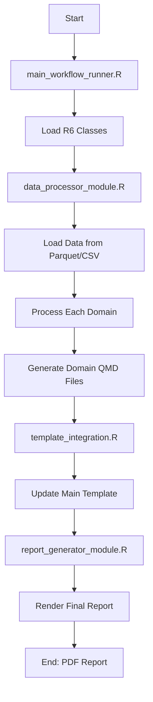

# README: Neuropsychological Report Workflow System

## Overview
This is a modular workflow system for generating comprehensive
neuropsychological assessment reports using R, Quarto, and Typst. The system
processes neuropsychological test data through multiple domains and generates
formatted reports.

## File Descriptions and Purpose
1. main_workflow_runner.R (Primary Entry Point)

Purpose: Main orchestrator that coordinates the entire workflow
What it does:

Prevents multiple simultaneous executions with a lock mechanism
Sources all required R6 classes (DomainProcessorR6, NeuropsychResultsR6, etc.)
Loads data from parquet files
Processes each cognitive/behavioral domain sequentially
Generates QMD files for each domain
Optionally renders the final report


Key function: run_neuropsych_workflow(patient, generate_qmd, render_report)
Output: Domain-specific QMD files and processed data

2. batch_domain_processor.R (Domain Definition)

Purpose: Defines the domains to be processed
What it does:

Sets up a guard to prevent re-running
Defines 8 main domains (IQ, academics, verbal, spatial, memory, executive, motor, emotion)
Provides a simple loop structure for processing


Note: This is more of a configuration file than an active processor

3. data_processor_module.R (Data Loading Module)

Purpose: Handles data loading and preprocessing
What it does:

Loads configuration from YAML files
Uses DuckDB for efficient data processing
Converts CSV data to optimized formats (parquet)
Manages error handling during data loading


Dependencies: Requires duckdb_neuropsych_loader.R

4. template_integration.R (Template Management)

Purpose: Integrates generated domain files into the main report template
What it does:

Updates main template with domain includes
Creates workflow templates if needed
Generates placeholder text files for missing content
Provides convenience functions for complete workflow execution


Key functions:

update_template_with_domains() - Inserts domain includes
run_complete_workflow() - Runs entire process
quick_workflow() - One-command execution


5. report_generator_module.R (Final Report Generation)

Purpose: Renders the final report using Quarto
What it does:

Locates and validates template files
Renders Quarto templates to PDF/HTML/DOCX
Handles multiple output formats
Moves final reports to output directory


Output: Final formatted report (PDF preferred)

#### Execution Order and Workflow


## Recommended Execution Sequence

### Option 1: Complete Automated Workflow (Recommended)


```r
# From your project root directory
source("inst/scripts/main_workflow_runner.R")

# Run everything with one command
results <- run_neuropsych_workflow(
  patient = "PatientName",
  generate_qmd = TRUE,    # Generate domain files
  render_report = TRUE     # Render final PDF
)
```

### Option 2: Step-by-Step Execution

```r
# Step 1: Setup and check environment
source("inst/scripts/template_integration.R")
quick_setup()  # Checks environment, creates directories

# Step 2: Process domains and generate QMD files
source("inst/scripts/main_workflow_runner.R")
run_neuropsych_workflow(
  patient = "PatientName",
  generate_qmd = TRUE,
  render_report = FALSE  # Don't render yet
)

# Step 3: Integrate domains into template
source("inst/scripts/template_integration.R")
update_template_with_domains()

# Step 4: Generate final report
source("inst/scripts/report_generator_module.R")
# This will render the template
```

### Option 3: Quick Workflow (Simplest)


```r
source("inst/scripts/template_integration.R")
quick_workflow()  # Does everything automatically
```

## Directory Structure Required
```
project_root/
├── R/                          # R6 classes and utilities
│   ├── DomainProcessorR6.R
│   ├── NeuropsychResultsR6.R
│   ├── DotplotR6.R
│   ├── TableGTR6.R
│   └── tidy_data.R
├── data/                       # Input data files
│   ├── neurocog.parquet
│   └── neurobehav.parquet
├── inst/
│   ├── scripts/               # Workflow scripts
│   │   ├── main_workflow_runner.R
│   │   ├── batch_domain_processor.R
│   │   ├── data_processor_module.R
│   │   ├── template_integration.R
│   │   └── report_generator_module.R
│   └── quarto/
│       └── templates/
│           └── typst-report/
│               └── config.yml
├── figs/                      # Generated figures
├── output/                    # Final reports
├── template.qmd              # Main report template
└── config.yml               # Configuration file
```

### Configuration file
---  
Configuration (config.yml)
yamldata:
  input_dir: "data"
  output_dir: "output"
  format: "parquet"

report:
  template: "template.qmd"
  format: "typst"
  output_dir: "output"

processing:
  verbose: true
  parallel: false
---
Key Features

Lock Mechanism: Prevents multiple simultaneous executions
Error Handling: Comprehensive try-catch blocks throughout
Modular Design: Each component can run independently
Format Flexibility: Supports PDF, HTML, DOCX outputs
Data Validation: Checks for data availability before processing
Progress Reporting: Detailed console output during execution
Environment Isolation: Uses separate environments for R6 classes

Troubleshooting
Common Issues:

"Workflow is already running"

Remove lock file: rm(.WORKFLOW_RUNNING, envir = .GlobalEnv)


"Data file not found"

Ensure parquet files exist in data/ directory
Check file permissions


"Template file not found"

Run create_workflow_template() from template_integration.R


"R6 class not found"

Ensure all R6 files are in the R/ directory
Check that files are being sourced correctly


Quarto rendering fails

Install Quarto: quarto::quarto_install()
Check template syntax
Verify all included QMD files exist


Best Practices

Always use the main workflow runner for consistency
Check data availability before processing
Keep configuration in YAML files for easy updates
Use absolute paths via here::here() for reliability
Enable verbose output during development
Create backups before major changes

